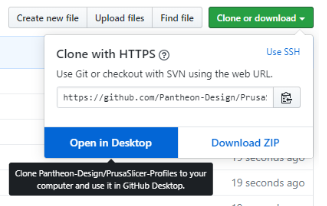
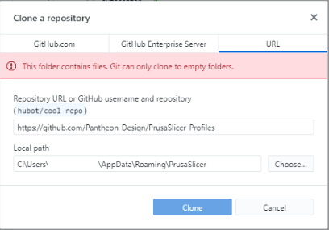

# PrusaSlicer-Profiles
Contains print profiles, filament settings, and printers for use in PrusaSlicer 

Setup Instructions
---------------------------
1. Under "Clone or download" select "Open in Desktop"

2. In the "Clone a repository" menu under local path enter your PrusaSlicer folder location
      mine was C:\Users\username\AppData\Roaming\PrusaSlicer
      you will get an error that the folder contains files
      

3. Create a backup of the "PrusaSlicer" folder and then delete it
4. Select "Clone" in the "Clone a Repository" menu
5. Done!
